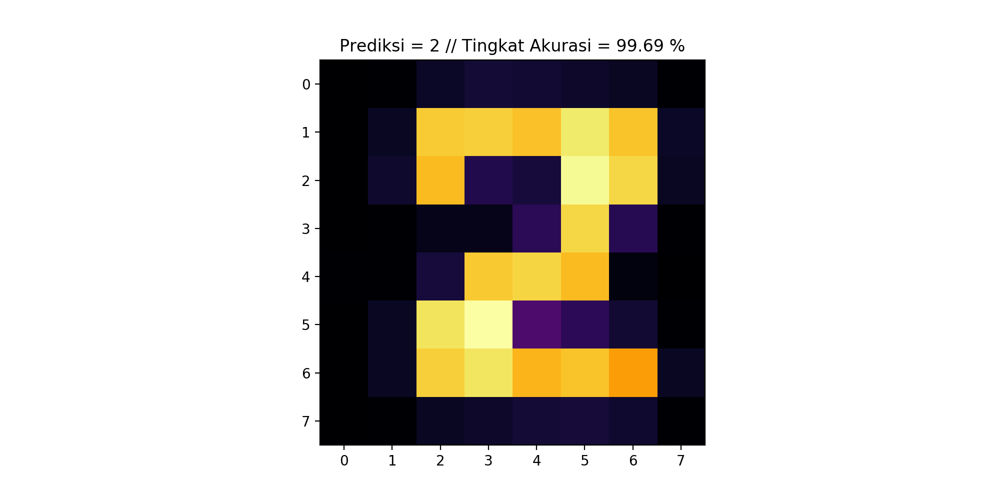

# DUMMY OF DIGITS IMAGE PREDICTION USING LOGISTIC REGRESSION

This repo is consist of __Classification Machine Learning -  Logistic Regression__ model which demonstrate the digits prediction.

1. Use [load_digits dataset provided by sklearn](https://scikit-learn.org/stable/datasets/index.html).
2. Make the Logistic Regression model
3. Conduct the training (before: split the data into data train & test)
4. Test some predictions from internal data
5. Calculate the scoring

After all process above, then it's time to predict the digits from external data. The external data was manually made in [make8bitart](https://make8bitart.com).

Utilize __Pillow__ to read the image in python, then convert it into 8x8 pixel (due to data train is consist of 8x8 pixel images). The result of machine learning prediction is shown below:

#
#### About Me: Suryo Tri Atmojo
#### Reach me out: _atmojo.suryo@gmail.com_

[GitHub](https://github.com/suryotriatmojo)
|
[Instagram](https://www.instagram.com/suryotriatmojo/)
|
[Facebook](https://www.facebook.com/suryo.t.atmojo)
|
[LinkedIn](https://www.linkedin.com/in/suryo-tri-atmojo-3ab69a85/)
|
[Twitter](https://twitter.com/suryota)